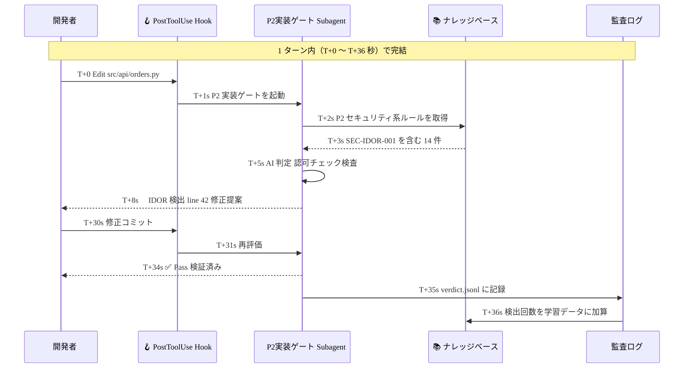

<small>──Karpathy が言う *Agentic Engineering* を「品質バーを下げない」運用に落とし込むため、Claude Code の Subagent / Hook / Skill / MCP を使って Plugin 化し、提案書作成の現場で動かしてみた記録──</small>

> ## 10 秒でわかるサマリー
>
> - Karpathy が言う **Agentic Engineering** ── 速いけど **品質バーは下げるな、ボトルネックは人間に移った**。SI 現場では特に重い話。
> - そこで、**Claude Code 上に「自己進化する品質ゲート」を Plugin 化** してみました。Subagent / Hook / Skill / MCP の組合せで、ナレッジは Git 管理＋外部 CVE を 24h で自動取込。
> - 実案件の提案書作成で動かしたら、**計画書の致命的問題 13 → 0 件 を一晩で**、**Vibe コードと納品基準のギャップを 8 件で可視化**。
> - 一式は **Apache-2.0 で GitHub 公開**（URL は §8）。**Claude Security 連携は初版スケルトンのみ**、本実装は後続。

---

## §0 なぜこの話題がいま重要か

ここ半年、開発の景色がガラッと変わりましたよね。「AI が書いてくれるから速い」だけじゃなくて、**仕事の組み立て方そのもの** が変わりつつある。これは個人の体感ではなく、業界レベルの構造変化です。一番すっきり整理しているのが、Andrej Karpathy 氏の最近の発信なので、まずそこから。

### Karpathy が示した 3 つの観察

#### ① 生産性が桁違いに上がった

> "It is hard to communicate how much programming has changed due to AI in the last 2 months: not gradually and over time in the 'progress as usual' way, but specifically this last December."
>
> 「過去 2 ヶ月で、AI によってプログラミングがどれだけ変わったかを伝えるのは難しい。漸進的にではなく、特に **この 12 月に** 変化が起きた」
>
> *— Andrej Karpathy（[X / 2026-01-26](https://x.com/karpathy/status/2026731645169185220)）*

Karpathy 氏は、自分が書く比率を **「自分 80% / AI 20%」から「自分 20% / AI 80%」に逆転** させたと言っています。つまりコードの大半は AI 任せ、自分は方針と確認だけ。

別の発信ではさらに踏み込んでいて、

> 「優秀な開発者が AI を使えば、ふつうの開発者の **10 倍以上の成果差** が出る現実が来ている」（趣旨）
>
> *— Karpathy 氏インタビュー要旨（[36kr](https://eu.36kr.com/en/p/3747726516601353)）*

10x エンジニアどころじゃない、ということです。これは「コードを速く書ける」だけの話ではなく、**プロジェクトの所要時間・体制規模・原価構造をひっくり返す** 話。経営から見れば「同じチームで何倍の仕事を捌けるか」「同じ案件を何分の一の人月で出せるか」に直結します。

#### ② ボトルネックは「打鍵」から「人間の判断」に移った

ここが今回いちばん言いたいところです。

> 「情報がまず自分の頭に入らなければならない…**何を作ろうとしているのかを把握すること自体で、自分がボトルネックになりつつある**」
>
> *— Karpathy 氏 Sequoia AI Ascent 2026 講演要旨（[philippdubach.com](https://philippdubach.com/posts/karpathys-software-3.0-playbook/)）*

> 「ツールの力を引き出すには、**自分自身がボトルネックにならないようにしなければならない**」

打鍵スピードはエージェントが解いてくれた。代わりに、**「何を作るべきか」「これでいいのか」を判断する人間** が追いつかなくなった。レビュー・意思決定・品質確認、人間の認知作業そのものが新しいボトルネックです。

> 「次の 10 年の制約は計算資源ではなく、**システムが実行する速度に、人間の理解の深まりが追いつけるかどうか**」（趣旨）

経営目線では「人を増やせば仕事が増える」モデルが崩れた、と言ってもいい。レビュアや PM の判断速度・スキルが、案件規模の天井になります。

#### ③ ただし、品質バーは下げるな

> "**Vibe coding raises the floor. Agentic engineering is about extrapolating the ceiling.**"
>
> 「Vibe coding は床を上げる。Agentic engineering は **天井** を引き上げる」

> "You are **not allowed to introduce vulnerabilities** because of vibe coding. You are still **responsible for your software**, just as before. But can you go faster? Spoiler: you can."
>
> 「Vibe coding を理由に **脆弱性を入れることは許されない**。あなたは依然として、自分のソフトウェアに **責任を負う**。しかし速くやれるか？ ネタバレ：やれる」
>
> *— Karpathy 氏 Sequoia AI Ascent 2026（[本人ブログ](https://karpathy.bearblog.dev/sequoia-ascent-2026/)）*

雰囲気で書いて動けば良し ── は個人プロジェクトなら成立する。けど SI の現場、つまり **顧客に納品し SLA を約束し業界規制に応える仕事** では通用しない。Karpathy 氏も「責任は人間に残る」とハッキリ言っています。

### この 3 つを並べると、SI 現場の問いが見えてきます


### 抽象論ではない ── 国内大手も同じ方向に動き出している（富士通 AI-DSDP の例）

「Karpathy が言ってるだけでしょ？」と思うかもしれませんが、実は **日本の SI 業界でも具体的な動きが始まっています**。象徴的なのが、2026 年 2 月の富士通 **「AI-Driven Software Development Platform（AI-DSDP）」** の発表。

| 項目 | 富士通 AI-DSDP の内容 |
|---|---|
| **発表** | 2026 年 2 月 17 日、運用開始 |
| **パートナー** | カナダ **Cohere** 社（共同開発） |
| **中核 LLM** | 日本語特化 LLM **「Takane」**（Cohere との共同開発、法令文書・複雑な業務知識に強い） |
| **自動化の範囲** | **要件定義 → 設計 → 実装 → 結合テスト** の全工程を、複数の AI エージェントが協調して実行 |
| **生産性の事例** | ヘルスケア領域の改修案件で **3 人月 → 4 時間（約 100 倍）** を達成 |
| **品質保証** | **Multi-layer Quality Control**（自動品質監査機能） |
| **サービス展開** | 2026 年度中に 67 業種への適用拡大、その後 **従量課金型サービスとしてグローバル提供** 予定 |

富士通自身が **3 人月 → 4 時間（100 倍）** の事例を出した、というのは重い。Karpathy が言う「12 月インフレクション」が、**もう日本の SI 現場で再現され始めている** ということです。

ただし、この発表を読むと **問いが 2 つ残ります**。

1. **独自 LLM や専用基盤を持てない大多数の SI ベンダー（中堅・中小・ベンチャー型）は、どう追いつくのか？**
2. **「Multi-layer Quality Control」の中身は何か？** 品質保証・セキュリティ・人間レビューの方法論を、もっと現場で再利用しやすい形で取り出せないか？

そこで個人の試みとして、**Claude Code（Anthropic Claude を背後に持つ開発環境）の上に Plugin / Skill を自作して、Apache-2.0 で OSS 公開する** という形で答えを作ってみました。独自 LLM の大規模投資はできなくても、**既存の Claude Code を基盤に Plugin / Skill を組めば、リソースの大小に関わらず手を動かせる** ── これが起点。**品質保証の中核（Agentic Quality Gate）を Git 管理・自己進化の仕組みとして実装** したのが本記事の中身です。加えて、**リアルタイムに近いセキュリティ対策として、Claude Code 標準の Claude Security（`/security-review` 等）を Subagent / Hook 経由で品質ゲートに組み込む計画** も並走中（§6）。

本記事で共有するのは、**この実装と、実案件の提案書作成の場面で個人として動かしてみた結果** です。「青写真の自律生成」と「動くデモの自動実装」── 2 つの場面で AI に作らせたものを、品質ゲートで担保しながら提案を仕上げるまでの記録、というところ。

---

## §1 SI 現場で直面する 3 つの折り合い

ここでちょっと立ち止まって、SI ベンダーの仕事の特徴を整理させてください。

### SI ベンダーが背負っているもの

| 経営的な要請 | ざっくり言うと |
|---|---|
| **継続的に利益を出す** | 薄利では終われない。生産性が出ないと事業が成立しない |
| **顧客に納品し続ける** | SLA・監査・規制対応・セキュリティ ── どれも妥協できない |
| **チームを回し続ける** | 属人化を避け、人が入れ替わっても品質を維持できないと困る |

要は、**生産性・品質・継続性の三点セット** が同時に問われる。どれか 1 つ欠ければ、利益・顧客・組織のどれかを失います。

### Karpathy の 3 観察を、SI 文脈に翻訳すると

| Karpathy の観察 | SI 現場にとっては |
|---|---|
| ① 生産性は桁違い | **千載一遇のチャンス**。逆に使いこなせなければ、競合に置いていかれる |
| ② ボトルネックは人間 | **新しい制約の正体**。PM・レビュアの判断速度が案件のスループットを決める |
| ③ 品質バーは下げるな | **退路はない**。速さのために品質を捨てた瞬間、SI 事業として詰む |

### 折り合いをつけないと、何が起きるか

3 つを同時に解こうとすると、たいてい次のどれかに落ちます。

| 罠 | やりがちなこと | 行き着く先 |
|---|---|---|
| ① **生産性だけ追う** | 速さ重視で品質を犠牲に | 品質事故 → 顧客喪失 |
| ② **品質だけ追う** | 速さを諦めて品質だけ守る | 利益が出ず、案件が回らない |
| ③ **人間でこなそうとする** | 増員でカバー | レビュア・PM がボトルネック化、属人化進行 |

3 つを同時に折り合わせる **仕組み** が要ります。それは個人の頑張りでは届きません。

### なぜ、今あるチェックリストでは足りないか

たいていの組織は、品質チェックリストを **持っています**。それでも事故は起きる。理由は次の 4 つに集約されます。


| 構造的な理由 | 何が起きるか |
|---|---|
| **① チェックリストが古くなる** | **OWASP**（OWASP Top 10 のような Web セキュリティ業界ベストプラクティスの更新）、**CVE**（公開された個別ソフトウェア脆弱性に毎日付与される ID）、法改正 ── どれも日次で動くので、年次更新では追いつかない |
| **② 散らばって、誰が最新か分からない** | PDF・紙・Confluence・個人ノートに分散、結局誰も最新を把握していない |
| **③ AI が読めない** | 人間目線の文章で書かれていて、AI が生成したコードを自動レビューできない |
| **④ いつ使うかが曖昧** | 「忙しい時にスキップ」されやすい。フェーズと観点の対応が明示されていない |

> **チェックリストって「持つ」より「動かし続ける」ほうが 100 倍難しい**。動かし続ける仕組みがあって初めて、価値が出ます。

そこで個人として必要だと感じたのは、**チェックリスト自体がコードのように Git で管理され、外部の変化で自動更新され、AI と人間が同じソースから判定でき、重要な判断は必ず人間が承認する仕組み** ── だいたいこれです。

それを束ねたのが、本記事で紹介する **Agentic Quality Gate（自己進化する品質ゲート）** というわけです。

---

## §2 Agentic Quality Gate とは何か ── 4 つの設計原則

名前は仰々しいですが、中身は 4 つのシンプルな原則です。図 1 枚で要点が伝わります。


### 4 原則をやさしく

#### ① ルールはコードのように管理する（Living Spec）

品質ルールは Markdown（人間にも AI にも読める）で書き、Git で管理します。**変更は PR でレビュー**、過去の判断は履歴から追える、間違ったら `git revert` で戻せる。

→「誰が最新か分からない」問題が消えます。

#### ② AI と人間が同じルールで判定する（Dual-Use）

1 つのルールファイルに、**「AI 用の自動判定指示」と「人間用のレビューチェック」を同居** させます。両方とも同じ「なぜこのルールが必要か」から派生しているので、言うことが食い違いません。

→「AI と人間で結論が違う」問題が消えます。

#### ③ 外部の変化を 24 時間で取り込む（Auto-Update）

毎朝、外を観測しに行きます。脆弱性 DB（NVD・GHSA）、政府機関の通達（個人情報保護委員会・IPA・JPCERT）、クラウド料金、業界事例 ── **該当しそうなものは 24 時間以内に「ルール更新の候補 PR」として上がります**。

→「年次更新じゃ遅すぎる」問題が消えます。

#### ④ 重要な判断は必ず人間レビュー（Human-in-Loop）

完全自動化はしません。**深刻度の高い変更（脆弱性・法務・認可・PII）は人間の承認必須**。新ルールはまず「Shadow mode」（判定はするけどブロックはしない）で 1 週間動かし、誤検知の感触をつかんでから本番投入。

→「AI が暴走する」「責任の所在が曖昧」問題が消えます。

### 4 つの原則 × Karpathy の 3 つの観察

| Karpathy の観察 | この設計のどこが対応しているか |
|---|---|
| ① 生産性は桁違い | **AI が品質判定を一気にこなす** ので、レビュー作業が現実的な工数に収まる |
| ② ボトルネックは人間 | **重要部分のみ人間レビュー** に絞ることで、人間のキャパが詰まらない |
| ③ 品質バーは下げない | **ルール自体を Git でバージョン管理** し、外部の変化に追随し続けるので、品質仕様そのものが陳腐化しない |

つまり、**Karpathy の3つの観察を、SIer の現場で同時に折り合わせるための装置** が、この4原則です。

---

## §3 仕組みの内側 ── どう動いているか

ここから先、ちょっと技術寄りになります。実装の手触りに興味がない方は **§5（動かしてみた結果）に飛んで OK** です。

### 3-1. Sensing（観測）から Feedback（学習）までの 6 つの層

外部世界からの情報が、品質ゲートのルールになっていく流れは、6 つの層に分かれます。


たとえば log4shell 級の重大な脆弱性が朝に公表されたとします。**観測層** がその情報を取り込み、**採点層** が「自社の使っているライブラリに該当しそう」と判定し、**ルール合成層** が新しいルール候補をまとめて、**夕方には組織のリポジトリに PR が立っている** ── そういう動き方をします。

### 3-2. 進化のしかたは 3 種類

ルールが更新されるきっかけは、3 種類あります。

| モード | 起動するきっかけ | スピード感 |
|---|---|---|
| **即応型（Reactive）** | 外部の脆弱性・規制・事例の公表 | **24 時間以内** に候補 PR |
| **定期型（Proactive）** | 月次・四半期のスケジュール | 月 1 回の棚卸し |
| **ふりかえり型（Reflective）** | 自社のインシデントや誤検知 | 事案ごとに随時 |

実際の流れは、CVE 公開から 24 時間以内のルール反映まで、次のシーケンスで動きます。


### 3-3. ソフトウェア開発の各フェーズに、それぞれ専用ゲートがある

開発のライフサイクル（構想 → 設計 → 実装 → テスト → 本番準備 → リリース → 運用）の **各フェーズに、専用のチェックゲート** が紐づいています。「いつ何を見るか」が明示的になります。


各フェーズに **専用のチェックリスト**（合計 137 項目、目標 200 項目）が紐づき、開発のフェーズが切り替わると自動で適用されるルールも切り替わります。

> **マネージャ向けの含意**：「いつ何を見るべきか」がフェーズに紐付いているので、忙しいプロジェクトで「忘れた」「飛ばした」が起きません。**提案書作成 → PoC → 本番開発 → 運用 まで、案件のライフサイクル全体で同じ仕組みが使い回せる**ことも大きな利点です。これが、Karpathy の言う **「人間自身がボトルネックにならない」運用** の具体形です。

---

## §4 Claude Code 上の実装 ── どこに何を置いたか

ここはガッツリ実装の話。**§5（動かしてみた結果）が記事の山場** なので、忙しい方はそちらへどうぞ。

### 4-1. なぜ Claude Code を選んだか

Claude Code には、品質ゲート構築に必要な部品が標準で揃っています。

| 必要なもの | Claude Code で対応する仕組み |
|---|---|
| 専門特化したエージェント | **Subagent**（フェーズごとの判定役） |
| イベントに反応する強制ガード | **Hook**（PreToolUse / PostToolUse / Stop / SessionStart） |
| 人間が能動的に呼び出すスキル | **Skill** |
| スラッシュコマンド | **Slash Command** |
| 設計フェーズの強制 | **Plan Mode** |
| 個人の横断知識 | **Memory** |
| 外部信号の取り込み | **MCP Server**（既存 + 自作） |

他のプラットフォームだと組み合わせが必要なものが、Claude Code には標準装備。**「開発する空間」と「品質ゲートが動く空間」を 1 つに置ける** のが大きな利点です。

### 4-2. プラグイン物理レイアウト

プラグインは次のような物理レイアウトで配置されます。ユーザーレベル（組織共通）とプロジェクトレベル（案件別）の二階層構成です。


### 4-3. Hook によるリアルタイムガードの例

`.claude/settings.json` で次のように宣言しておくと、開発フローに自然に溶け込みます。

```json
{
  "hooks": {
    "SessionStart": [
      { "command": "$CLAUDE_PLUGIN_ROOT/hooks/sessionstart-show-status.sh" }
    ],
    "PreToolUse": [
      { "matcher": "Bash",
        "command": "$CLAUDE_PLUGIN_ROOT/hooks/pretooluse-block-risky.sh" }
    ],
    "PostToolUse": [
      { "matcher": "Edit|Write",
        "command": "$CLAUDE_PLUGIN_ROOT/hooks/posttooluse-scan-secrets.sh" }
    ],
    "Stop": [
      { "command": "$CLAUDE_PLUGIN_ROOT/hooks/stop-gate-verdict.sh" }
    ]
  }
}
```

| Hook | 何をするか |
|---|---|
| **SessionStart** | 現在のフェーズと、未解決の指摘を起動時に表示 |
| **PreToolUse** | `rm -rf` / `git push --force` / `DROP TABLE` などの破壊的操作をブロック |
| **PostToolUse** | コード編集後に自動でシークレット・PII・IDORスキャン |
| **Stop** | ターン終了時に判定ログ（verdict.jsonl）に追記 |

### 4-4. 1ターンの中で「検出 → 修正 → 再判定 → 学習」が閉じる

`src/api/orders.py` を編集してから36秒で、IDOR（本来見えてはいけないデータが、URL を変えるだけで見えてしまう脆弱性）を検出 → 修正 → 再判定 → 学習が一周します。



### 4-5. 外部信号の取り込み（MCP Server）

| 取り込む情報 | 実装 |
|---|---|
| Web 検索全般 | tavily-search MCP（既存） |
| クラウド料金・状態 | プラットフォーム MCP（既存） |
| GitHub Advisories | gh CLI 経由 |
| 脆弱性データベース | 自作 MCP（Python の `mcp` SDK で 200 行程度） |
| 政府機関フィード（個人情報保護委員会・IPA・JPCERT） | 自作 MCP（HTML scraper + LLM 要約） |
| LLM Provider のリリース | 自作 MCP（各社ブログを巡回） |

**自作 MCP は 1 サーバ 200 行程度** で組めるので、6 サーバを 2 スプリントで整備可能です。

---

## §5 動かしてみた結果 ── 提案書作成の現場で品質ゲートを試した

ここが記事の山場です。

> ある **BtoC 大手事業者から提示された RFP** に対する **提案書作成の場面** で、個人として試してみた話。社名・業界・規模・技術スタック名は伏せています。

### 5-1. なぜこの場面で品質ゲートを試したか

RFP を受け取ってから提案書を出すまでの期間って、ほんと限られてるんですよね。しかも **「リアルかつ根拠ある提案」じゃないと案件は取れない**。具体的には次の 2 つを満たす必要があります。

1. **プロジェクト全体の青写真**（投資判断・アーキ・要件・リスク・WBS・コスト）が、机上の空論じゃなく **整合的で実行可能なレベル** で描けている
2. **技術的なフィジビリティ**（本当に動くのか）が、**実際に動くデモ画面** として裏付けられている（アペンディクスに添付）

この 2 つを **短期間で・恥ずかしくない品質で** 作るには、AI を使い倒すしかない。一方で AI に任せきりで品質が崩れたら、提案そのものが信用を失う。

そこで個人の取り組みとして、**提案書作成プロセス自体に Agentic Quality Gate を入れて、AI 生成物を品質ゲートで担保しながら高速に仕上げる** という運用を試してみました。これが今回の検証の中身です。

### 5-2. 2 つの検証の構図

| | **検証 A：青写真フェーズの品質ゲート** | **検証 B：デモ実装フェーズの品質ゲート** |
|---|---|---|
| **何を作る場面か** | 提案書の中核となる **プロジェクト全体の青写真** | 提案書アペンディクスに添付する **動くデモ画面（フィージビリティ証拠）** |
| **対象フェーズ** | P0 構想 / P1 設計 + 横串（法務・LLMガバナンス） | P2 実装 + 横串（LLM セキュリティ） |
| **誰が成果物を作るか** | PM AI が自律生成（pm-blueprint Skill） | 実装 AI が Vibe Coding で記述 |
| **対象成果物** | 計画書類（数十文書） | デモプログラムのコード（Streamlit / Python / SQL） |
| **何を検証したか** | **提案として通用する青写真品質を、AI 自走で仕上げられるか** | **SI 納品基準とのギャップを引用付きで可視化できるか** |
| **検出された致命的問題** | **13 件** → 自動改善ループで **0 件** | **8 件**（うち 5 件はセキュリティ系） |
| **自動改善ループ** | ✅ 起動（一晩で AI が 30 文書を改善） | ⏸️ 本サイクルでは未起動（理由は §5-4） |
| **示せた事実** | 青写真フェーズで **品質を保ったまま大幅加速** が可能 | 「動くデモ」と「納品できるシステム」の差分を **数値で可視化** |

両検証はそれぞれ独立した「品質ゲートの実装と検証実例」であり、**「Karpathy が言う *品質を下げずに加速する* を、提案書作成という現実の SI 業務で実装した記録」** になります。

### 5-3. 共通のセットアップ ── 専門 AI と品質ゲートの配置

各フェーズに専門 AI を配置し、その中央に品質ゲートを置きます。品質ゲートは AI からの成果物を受け取り、引用付きで指摘を返します。


### 5-4. 検証 A：青写真フェーズの品質ゲート ── 提案書の中核となる計画書を AI 自走で仕上げる

#### 何を検証したか

PM AI（pm-blueprint Skill）が **顧客提示の RFP から自律的に作った提案書青写真（プロジェクト計画書）** に対し、品質ゲートが 176 観点で評価し、その結果を PM AI にフィードバックすることで **「提案として通用するレベルの青写真を、AI 自走で仕上げられるか」** を見ました。

#### 起きたこと（Day 0 → Day 1）

成果物 → 評価 → 改善指示 → 再生成 → 再評価 を、品質基準達成まで自動で繰り返します。人間は方針承認のみ。


#### 結果のサマリー

| 指標 | 第 1 サイクル（Day 0 夕方） | 第 2 サイクル（Day 1 朝） |
|---|---|---|
| 致命的問題 | **13 件**（不合格） | **0 件**（条件付合格 ✨） |
| 合格項目 | 4 件 | **30 件** |
| 整備された文書数 | 21 文書 | **51 文書** |
| 前回指摘の反映度 | ─ | **77%** |

#### 検出された 13 件はどう処理されたか

| パターン | 件数 | 内容 |
|---|---:|---|
| ✨ **完全解消** | 8 件 | 個人情報の取り扱い、改正法対応、データモデル、AI 出力検証 ほか |
| ⚠️ **枠組み整備済（条件付合格）** | 5 件 | 業法判断（顧問弁護士契約待ち）、バッチ仕様書、環境分離 IaC、AI 攻撃の実機テスト |
| ❌ 未対応 | 0 件 | （全項目に何らかの対応がなされた） |

実際の評価ダッシュボード（前回比）の俯瞰はこちらです。Pass 4 → 30、Critical Fail 13 → 0、整備文書数 21 → 51（+30）、前回指摘の反映度 77%。


#### 検証 A の結論

- **品質ゲートは、提案青写真の致命的不足を 13 件、引用付きで具体指摘できた**
- **その指摘を PM AI に戻すと、一晩で 30 文書を AI が自律改善した**（人手なら週単位の作業量）
- **再評価で致命的問題 0 件、提案として通用する水準に到達**
- **人間の関与は方針承認と最終レビューのみ**。青写真の生成と品質判定は AI が自走

> **技術的な含意**：提案書の青写真（投資判断・アーキ・要件・リスク・WBS・コスト）は、これまで「PM やアーキテクトが何週間もかけて手書きする」工程でした。今回、**品質を保ったまま、その工程を一晩〜数日で回せる**ことが実証されました。これは **提案リードタイムの圧縮、見積精度の向上、PoC 着手前の品質担保** といった、SI 工程上の改善効果につながります。Karpathy が言う *"You are still responsible for your software, but can you go faster? Spoiler: you can"* が、提案フェーズで成立した一例です。

### 5-5. 検証 B：デモ実装フェーズの品質ゲート ── 提案書アペンディクスのデモ画面と SI 納品基準のギャップ

#### 何を検証したか

提案書のアペンディクスに添付する **「フィージビリティ・スタディとして動くデモ画面」** を、実装 AI が Vibe Coding で一気に組み上げた試作プログラム。これに対し品質ゲートが P2 実装フェーズの観点（シークレット管理 / 認可 / LLM 入力境界 / プロンプト注入 / テスト戦略 など）で評価し、**「動くデモ」と「実際に SI として納品するときに足りない要素」のギャップを引用付きで可視化できるか** を見ました。

#### 検出された 8 件（うちセキュリティ系 5 件）

| # | 問題 | わかりやすく言うと |
|---|---|---|
| 1 | LLM 入力境界の不備 | 顧客の生データ（個人情報含む）を、マスキングなしで LLM に送っていた |
| 2 | LLM 出力の無検証実行 | LLM が書いた SQL がそのまま実行される構造（攻撃者が AI に意地悪な質問をすれば、本来見えないデータを引き出せる可能性あり） |
| 3 | 認証なし | ダッシュボード画面に認証がなく、URL を知れば誰でも見える |
| 4 | アクセス追跡不能 | 全員が同じパスワードで使う運用、誰がアクセスしたか分からない |
| 5 | プロンプト注入対策なし | AI への悪意ある指示注入を防ぐ仕組みがない |

加えて品質保証系3件（自動テスト不在、LLM 評価セット不在、CI に脆弱性スキャンなし）。

#### なぜこのサイクルでは改善ループを起動しなかったか

検証 A（青写真側）と異なり、検証 B では **意図的に自動改善ループを起動しませんでした**。理由は3つあります。

1. **設計判断の余地が大きい** ── 認証方式の選定、サンドボックスの実装方針、PII マスキング手法 ── 経営判断や人間の意思決定が先に必要な項目が多く、AI に丸投げする前にアーキテクチャ会議が要る
2. **修正範囲が広い** ── ファイル横断の構造変更（共有パスワード → SSO 移行など）が含まれ、1 回のループでは収束しない
3. **検証目的のスコープを区切った** ── 今回のデモ実装の目的は「**フィージビリティ・スタディとして動くこと**」であり、本番納品品質まで仕上げる必要はなかった。検証目的も「**品質ゲートが SI 納品基準とのギャップを正しく可視化できるか**」に絞り、それは **8 件の致命的問題の引用付き具体指摘** として達成された

#### 検証 B の結論

- **品質ゲートは、ファイル：行レベルの引用付きで、実装フェーズの致命的問題 8 件を指摘できた**
- 「フィージビリティとして動くデモ」と「SI として納品する本番システム」の差を、**8 件分の落差** として数値化できた
- 検証 A の自動改善ループのメカニズムは、設計判断を人間と擦り合わせた後であれば、**実装フェーズでも同様に有効** である見込みが高い

> **技術的な含意**：提案書のアペンディクスに「動くデモ」を添えるのは、提案の説得力を高める実装手段の 1 つです。一方で、その動くデモをそのまま本番化すると **致命的なセキュリティ問題が紛れ込みます**（今回の例では 8 件）。今回、**「提案時点で見せるデモ」と「本番納品時の品質バー」の差を、コード行レベルで数値化** できました。これは **見積精度・契約交渉・リスク説明** といった工程改善に効きます。Karpathy が言う *"You are not allowed to introduce vulnerabilities because of vibe coding"* を、提案書フィージビリティの段階で運用化した実例です。

### 5-6. 横断検証：観測層が同期間に捕捉した世界の変化 3 件

提案書作成のサイクルが回っている裏側で、**観測層 → 採点層 → ルール合成層** のパイプラインが、直近 30 日の外部信号 29 件を取り込み、関連度の高い 13 件を抽出、**新規対応候補 6 件** を提示しました。最優先 3 件はこちらです。

| # | 事象 | 影響 |
|---|---|---|
| 1 | **本案件で利用予定の LLM プラットフォームに重大脆弱性が公表** | 即時バージョン更新が必要、ADR 起票 |
| 2 | **国内法の AI 関連規制改正動向** | 法令対応マトリクスへの項目追加、リスク評価の更新 |
| 3 | **間接プロンプト注入の実害が業界全体で急増** | RAG 信頼境界マーカー、入力サニタイザの実装が必須化 |

**観測層が稼働していなければ、これら 3 件は青写真評価にもデモ実装評価にも反映されないまま提案書が進んだ可能性が高い** ── これが、Karpathy の言う「ボトルネックは人間」問題に対する答えのひとつです。**世界の変化を「人間が逐一読んで判断する」工程を、AI が代行**します。

### 5-7. 2 つの検証から見えた事実

| 観点 | 検証 A（青写真フェーズ） | 検証 B（デモ実装フェーズ） |
|---|---|---|
| Karpathy「品質バーを下げない」 | 提案青写真で **下げずに加速** が成立 | デモコードに対し **品質バー差分の定量可視化**（8 件分の溝） |
| Karpathy「エージェントはインターン」 | PM AI に対し **品質ゲートが監督役**、Day 0→Day 1 で 13→0 | Vibe Coding 由来コードへ **8 件の引用付き指摘**、人間が設計判断を主導 |
| Karpathy「ボトルネックは人間」 | 青写真作成・レビューを AI 自走化 = **人間の判断速度の壁を回避** | 致命的問題の検出を AI 自走化 = **レビュア負荷の回避** |
| プロ SIer の責任分担 | 方針承認と最終レビューのみ、文書生成は AI 自走 | 設計判断は人間、検出と修正提案は AI |
| 自動改善ループ | ✅ 起動（30 文書を一晩で改善） | ⏸️ 本サイクルでは未起動（受注後の本番化で適用予定） |
| 提案フェーズで得られる効果 | **提案青写真の精度・速度が同時に上がる** | **「動くデモ + 品質ギャップの定量説明」が成立** |

> **これは「AI が書いた成果物の品質を、別の AI が評価し、結果をフィードバックして自動改善する」という Agentic DevOps の最初の成功事例の 1 つです。**
>
> 提案書作成という、SI ベンダーの生命線である業務で、**青写真フェーズでは完全な自動ループ** が、**デモ実装フェーズでは品質ゲートの検出能力と SI 納品基準とのギャップ可視化** が成立しました。両者は同じ品質ゲート基盤の異なる適用例であり、**提案書作成 → PoC → 本番開発 → 運用 まで、SDLC 全域に Agentic Quality Gate を展開可能** であることを示しています。

---

## §6 限界と現実 ── 銀の弾丸ではありません

正直に書きます。本仕組みも完璧ではありません。Karpathy 氏も「AI には取扱説明書はなく、得意・不得意がデコボコ」と警告していますが、それは本仕組みにもそのまま当てはまります。

### 構造的な制約 4 つ

| 制約 | 対処の方針 |
|---|---|
| **真のリアルタイム検知は不可** | 外部信号（CVE 等）は数分〜時間オーダーになる。緊急情報は PagerDuty 等の外部アラートと併用。**コード変更時の「リアルタイムに近い」セキュリティ検知は、後述の Claude Security 統合で補強予定**。 |
| **AI 呼び出しのコスト** | LLM 判定は重要点に絞る。情報の取込は構造化抽出で軽量化 |
| **AI 判定の再現性** | 重要ゲートは決定論的なツール（SAST/SCA/lint）を主軸にし、AI は補完的に |
| **MCP の生態系がまだ薄い** | 主要クラウド以外は自作 MCP の保守コストを織り込む。最初は WebFetch で済ませて段階拡充 |

### 拡張計画：Claude Security によるリアルタイムに近いセキュリティ強化

外部 CVE 取込は 24 時間サイクル（観測層）が現実解ですが、**「コードを書いた瞬間〜コミット前」のセキュリティ検知は、より速いサイクルで動かす必要** があります。これに対し、**Claude Code 標準の Claude Security（`/security-review` Skill 等）** を品質ゲートに統合する計画を、個人の継続課題として進めています。


| 対応する観点 | Claude Security 統合で実現する動き |
|---|---|
| コード変更時の即時検知 | **PostToolUse Hook → Claude Security Subagent → 引用付きの脆弱性指摘**（数秒〜十秒オーダー） |
| プロンプト注入・LLM 入力境界 | Claude のセーフティ機構を Subagent としてラップし、**LLM 入力の前段で自動スキャン** |
| シークレット混入・PII 漏洩 | Claude Security の検知ルールを **品質ゲートのナレッジに同期**（Living Spec として Git 管理） |
| 監査証跡 | Claude Security の判定結果を **verdict.jsonl に追記**、人間レビュー対象として可視化 |

これにより、**外部 CVE 取込（24h）と、コード変更時の即時セキュリティ検知（数秒〜数十秒）の二層構成** となり、SI 納品で求められる「動き続けるセキュリティ」を現実的に実装できます。Plugin 内には既に `agents/claude-security-adapter.md` / `skills/claude-security/` / `commands/claude-security.md` の **スケルトン**（インターフェース定義と最小骨格）が配置済みで、**本記事公開時点では当面このスケルトンのみを GitHub に公開**します。Claude Security との実統合（Subagent / Hook の本実装、判定ロジック、評価セット連携）は **後続リリースで段階的に追加** していく計画です。

### 採用判断者が押さえるべき 4 つの問い

| 問い | 答えの方向 |
|---|---|
| **Q1：監査対応は通るか** | 全 PR が Git に残り再現可能。critical 系は人間承認必須。**監査では「誰が、いつ、何を承認したか」が追える** |
| **Q2：運用コストはいくらか** | MVP の最初の段階（種ナレッジ整備）だけでも価値が出る。Curator は段階導入可能。**月額予算を設定し、誤検知率を測定して閾値最適化** |
| **Q3：開発者は受け入れるか** | 新ルールは Shadow mode（警告のみ）で 1 週間試運転。誤検知が多ければ即対処。「ブロック」より「警告」を多用 |
| **Q4：ベンダーロックは大丈夫か** | **ナレッジは Markdown + Git なので移植性は極めて高い**。Claude Code への依存は最小化されている |

### 6 週間で立ち上げる現実的なロードマップ


各ステップの Deliverables を含む詳細はこちら（プレゼン版）：


| Step | 期間 | やること | 完了時に手に入るもの |
|---|---|---|---|
| **Step A** | Week 1 | 種ナレッジ整備（致命的 38 件を Markdown で書き起こし） | 人間がチェックリストとして使える状態 |
| **Step B** | Week 2-3 | 人間消費パスを通す（チェックリスト Skill 実装、PR レビューで実用化） | レビュー会・PR レビューで実用的に回る状態 |
| **Step C** | Week 3-4 | Hook で強制（PreToolUse / PostToolUse / Stop / SessionStart） | AI が書いたコードに即時ガードがかかる状態 |
| **Step D** | Week 5-6 | Curator で自動化（ingest mode + Shadow mode を 1 週間運用） | ナレッジが自動進化を始める状態 |

「完璧 vs 何もしない」ではなく、**Step A から段階的に導入し、運用しながら最適化する** ── これが現実解です。**Step A を 1 週間でやるだけでも、人間レビューに使える状態が手に入ります**。

---

## §7 まとめ ── 「持つ」より「動かし続ける」

ここまで読んでくれてありがとうございました。最後にざっくりまとめます。

Karpathy が示したのは **3 つの不可逆な変化** です。

| Karpathy の観察 | SI 現場にとっては |
|---|---|
| 生産性が桁違いに上がる | 同じ案件を、より少ない人月・短い期間で出せる **千載一遇のチャンス** |
| ボトルネックは人間に移った | レビュア・PM の判断速度が **新しい競争軸**。人を増やしても直線的には伸びない |
| 品質バーは下げるな | SI には **退路がない**。速さと品質を両立しないと事業が回らない |

言いたいことはシンプルです。

> **3 つを同時に折り合わせる仕組みがあって初めて、SI 現場で品質と速度が両立できる。**
>
> 個別の頑張りや属人ノウハウだけじゃ追いつきません。**「品質を Git で管理し、AI も人間も同じソースから判定し、外部の変化を 24h で取り込み、重要な判断は必ず人間が承認する」── そういう仕組みが要る**、というのが本記事の主張です。
>
> 富士通は独自 LLM「Takane」と AI-DSDP で **100 倍の生産性事例** を出しました。一方、独自 LLM 投資ができる立場じゃない一個人の試みとして、**既存の Claude Code 上に Plugin / Skill を自作して Apache-2.0 で OSS 公開する** という形で同じ方向の枠組みを組んでみました。**提案青写真の致命的問題を一晩で 13→0 件に改善する自動ループ**が成立、**Vibe Coding 由来のデモコードと SI 納品基準のギャップを 8 件で可視化** できた。**Claude Security の組込み拡張**は個人の継続課題として並走中（初版はスケルトンのみ、本実装は後続）。
>
> つまり、**大手の専用基盤がなくても、今ある道具を独自に組み合わせれば同じ方向に向かえる** ── これが、本記事で示したかった一例です。

Karpathy 自身が「自分がボトルネックにならない」を次の競争軸に挙げている。**それを実装に落とすための仕掛けが Agentic Quality Gate** ── ひと言でいえば、これに尽きます。

### この記事で伝えたかったこと

チェックリストは「持つ」より **「動かし続ける」ほうが 100 倍難しい**。動かし続ける仕組みがあって初めて、価値が出ます。

本記事の試みが、同じ課題と向き合う SI ベンダー、コンサル、エンタープライズ IT 部門の方々の、何かのヒントになれば嬉しいです。

実装一式（Plugin / pm-blueprint Skill）は §8 から参照できます。フィードバックや改善提案は GitHub の Issue / PR を歓迎します。


---

## §8 公開リソース

### 実装一式（GitHub OSS、Apache License 2.0）

🔗 **公開先**：<https://github.com/kiwiiosaru-jp/agentic-quality-gate>

公開している成果物：

- **Claude Code Plugin**（agentic-quality-gate） ── 8 Subagent / 6 Skill / 6 Slash Command / 176 件のナレッジ + Excel ドライバ
- **pm-blueprint Skill** ── 提案書青写真（プロジェクト計画書）を 9 レイヤ（Executive / Hypothesis / Architecture / Requirements / Risk / Execution / Legal-Compliance / LLM-Governance / Operations）で自律生成するスキル
- **Excel ドライバ**（`plugin/knowledge/master.xlsx`） ── ナレッジを Excel から駆動するための単一ソース
- **Claude Security 統合（スケルトン版）**（`plugin/agents/claude-security-adapter.md` / `plugin/skills/claude-security/` / `plugin/commands/claude-security.md`） ── Claude Code 標準の Claude Security を品質ゲートに統合する拡張ポイント。**当面はインターフェース定義と最小骨格のみを公開**し、本実装（Subagent / Hook の本体・判定ロジック・評価セット連携）は後続リリースで段階追加します。

ブランチ構成：

- `main` ── 公開向け（タグ付きリリース予定）
- `dev` ── 進行中の改善作業

### 一番シンプルな使い方 ① ── 品質ゲート（`agentic-quality-gate` Plugin）

> **任意のフォルダにレビューしたい成果物一式（RFP・計画書・設計書・コード・ADR 等、何でも）を格納し、Claude Code に自然言語で「このフォルダの成果物をレビューして」と指示するだけ** ── あとは Plugin が次を全部やります：
>
> 1. **成果物の内容を自律的に把握**（フォルダ構造・命名・技術スタックを探索、ハードコードされたパス前提なし）
> 2. **該当するフェーズ（P0 構想 / P1 設計 / P2 実装 / … / Cross-cutting）を特定**
> 3. **そのフェーズで適用すべきチェック観点・評価指標を、ナレッジベース（176 件）から自動参照**
> 4. **各観点について Pass / Conditional / Fail / N/A を引用付きで判定**
> 5. **評価結果を Markdown 報告書として出力**（経営層 / レビュアー / 開発者の 3 視点で構造化）

実行例：

```bash
/aqg:evaluate ~/projects/my-rfp-and-plan

# あるいは自然言語で
「~/projects/my-rfp-and-plan にある成果物を agentic-quality-gate でレビューして」
```

→ `reports/{timestamp}_{プロジェクト名}.md` に評価結果が出力されます。

#### ナレッジは Excel が起点 ── 人間も AI も同じソースを見る

品質ゲートの判定基準は **Excel ファイル `master.xlsx`（176 件のチェックリスト）** が単一ソースになっています。**Excel と Markdown を二段運用** することで、人間と AI の双方が同じ判定基準を共有します。

- **人間**（PM・レビュアー・QA）は **Excel を開いて閲覧・編集**できます。各チェック項目（観点 / OK 基準 / NG 基準 / 必要証跡 / 判定者 等）は誰でも読んで理解できる粒度で記述。**チェック項目の追加・修正・削除は Excel 側で直接実施可能** です
- **AI エージェント** は、Excel から自動派生された **Markdown ファイル群** を読み込んで判定します（`scripts/excel_to_md.py` で都度変換）
- 品質ゲート実行のたびに、**AI が自律的に新しいチェック観点を Excel の `candidates` シートに追加**（外部 CVE / 規制改正 / 業界事例 / 自社インシデント等から自動抽出）
- 人間は Excel で `candidates` を確認して採用判断、採用なら `Checklist` シートに昇格 → 再度 Markdown 派生で AI に反映

つまり、**AI が自律的に充実させ、人間が Excel で確認・最終承認できる** 二重ループ。これにより、チェックリストが陳腐化せず常に最新化されていきます。

```
master.xlsx（人間が読む / 編集する）
    │
    │ excel_to_md.py で自動変換
    ▼
knowledge/{phases,cross-cutting}/*.md（AI が読む）
    ▲
    │ AI が候補を candidates シートに自動追加
    │ → 人間が採用判断 → Checklist 昇格 → 再派生
    │
master.xlsx（更新）
```

### 一番シンプルな使い方 ② ── プロジェクト計画自動作成（`pm-blueprint` Skill）

> **任意のフォルダに RFP（提案依頼書）や要件概要のテキストを置き、Claude Code に自然言語で「この RFP からプロジェクト計画書一式を作って」と指示するだけ** ── あとは Skill が次を全部やります：
>
> 1. **RFP / 要件概要を読み解いて、不足情報を仮説で補う**（前提抽出 / ディスカバリー、未確定事項には `[仮定]` タグを付与）
> 2. **アーキテクチャ判断（ADR）・データ設計・API 設計を起こす**
> 3. **機能要件（ユースケース）・非機能要件（SMART-NFR・EARS 形式）を整理**
> 4. **リスク洗い出しと Kill 基準を設定**（事前検死・リスクレジスタ・脅威モデリング）
> 5. **法務・コンプライアンス対応 / LLM ガバナンス / 運用設計まで網羅**
> 6. **投資判断（Go/No-Go）と矢羽パターンの WBS を生成**
> 7. **最終的に 12 セクション以上のプロジェクト計画書一式を Markdown で出力**

実行例：

```bash
「pm-blueprint を使って ~/projects/my-rfp/RFP.md から計画書を作って」
```

### ① + ② の連携利用（推奨）

提案書作成や PoC 立ち上げの場面では、**「pm-blueprint で生成 → agentic-quality-gate で評価 → 改善ループ」** が最大効果を発揮します。本記事 §5 で実証した「一晩で 13→0 件」は、まさにこのループの成果です。

### 著者

**湘南さーふぃんおやじ** ── データ／AI 領域で仕事してます。本記事の実装は個人の取り組みとして公開しています。

- 📧 著者連絡先：[s.abe@churadata.okinawa](mailto:s.abe@churadata.okinawa)
- 所属：ちゅらデータ株式会社（[公式](https://churadata.okinawa/) / [Qiita Organization](https://qiita.com/organizations/churadata)）

### Karpathy 一次・準一次ソース

- 🎤 [Sequoia Ascent 2026 summary | karpathy.bearblog.dev](https://karpathy.bearblog.dev/sequoia-ascent-2026/)（Karpathy 本人ブログ）
- 🎥 [From Vibe Coding to Agentic Engineering | YouTube](https://www.youtube.com/watch?v=96jN2OCOfLs)（Sequoia AI Ascent 2026 講演）
- 🐦 [@karpathy on X — December inflection (2026-01-26)](https://x.com/karpathy/status/2026731645169185220)
- 📰 [Karpathy on AI Taking Over 80% of Code | 36kr](https://eu.36kr.com/en/p/3747726516601353)（生産性倍率と人間ボトルネックに関する解説）
- 📰 [Karpathy's Software 3.0 Playbook: 12 Lessons from Sequoia | philippdubach.com](https://philippdubach.com/posts/karpathys-software-3.0-playbook/)（人間ボトルネックの議論を含む詳細解説）
- 📰 [Karpathy Declares Vibe Coding Obsolete | Analytics Drift](https://analyticsdrift.com/andrej-karpathy-agentic-engineering-software-3/)
- 📰 [What is Agentic Engineering? | IBM](https://www.ibm.com/think/topics/agentic-engineering)
- 📰 [From Vibe Coding to Agentic Engineering | AI Agents Simplified](https://aiagentssimplified.substack.com/p/from-vibe-coding-to-agentic-engineering)

### 国内 SI 大手の動き（富士通 AI-DSDP 関連）

- 🏢 [富士通公式プレスリリース：ソフトウェア全工程を AI エージェントが協調実行する開発基盤を運用開始 (2026-02-17)](https://global.fujitsu/ja-jp/pr/news/2026/02/17-01)
- 🏢 [富士通 AI-Driven Software Development Platform 紹介ページ](https://global.fujitsu/ja-jp/technology/key-technologies/ai/ai-dsdp)
- 📰 [事業構想オンライン：富士通 ソフト開発の全工程を AI で自動化する基盤を運用開始](https://www.projectdesign.jp/articles/news/0cf0b49a-13ba-4392-9794-ed9f88b72669)
- 📰 [日経クロステック特別企画：「生産性 100 倍」の衝撃 AI が"全工程"を無人化・自律化 富士通](https://special.nikkeibp.co.jp/atclh/NXT/26/fujitsu0325/)
- 📰 [富士通 Insight：システム開発の「常識」を過去にする ─ 富士通の AI が導く「SI 変革」と"爆速"生産性](https://global.fujitsu/ja-jp/insight/tl-leadership-ai-20260217)
- 📰 [日経クロステック：富士通が AI 駆動で開発工程を自動化、ビジネスも人月型から FDE 型へ](https://xtech.nikkei.com/atcl/nxt/column/18/00001/11508/)

### ライセンス

本記事に紐付く実装一式は **Apache License 2.0** で公開します。商用利用・改変・再配布可、特許クレーム保護を含みます。

---

> **Quality as Code × Living Spec × Agentic Evolution**
> ── 品質ゲートが「コード」になり、「生きて」、「進化する」世界へ

---

> *記事の内容は私個人の経験・見解であり、所属する企業・団体・組織を代表するものではありません。*
