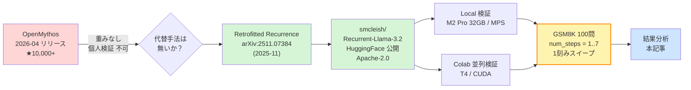
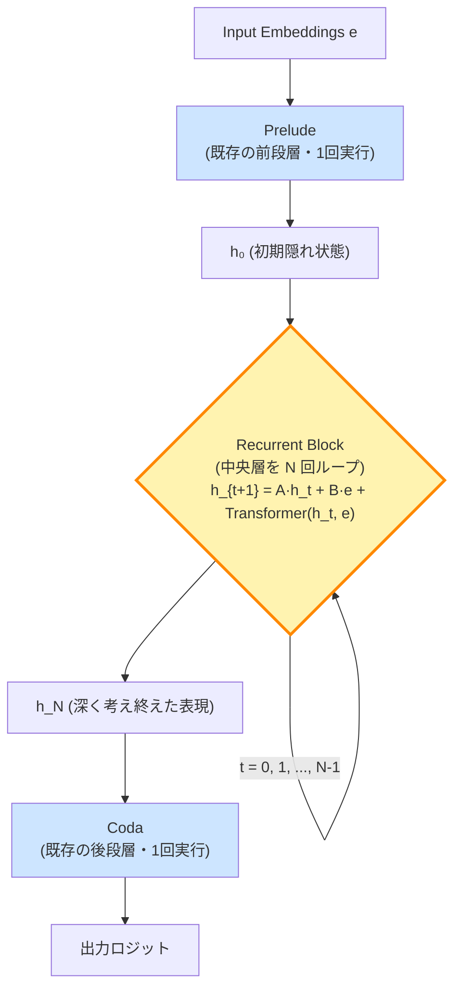
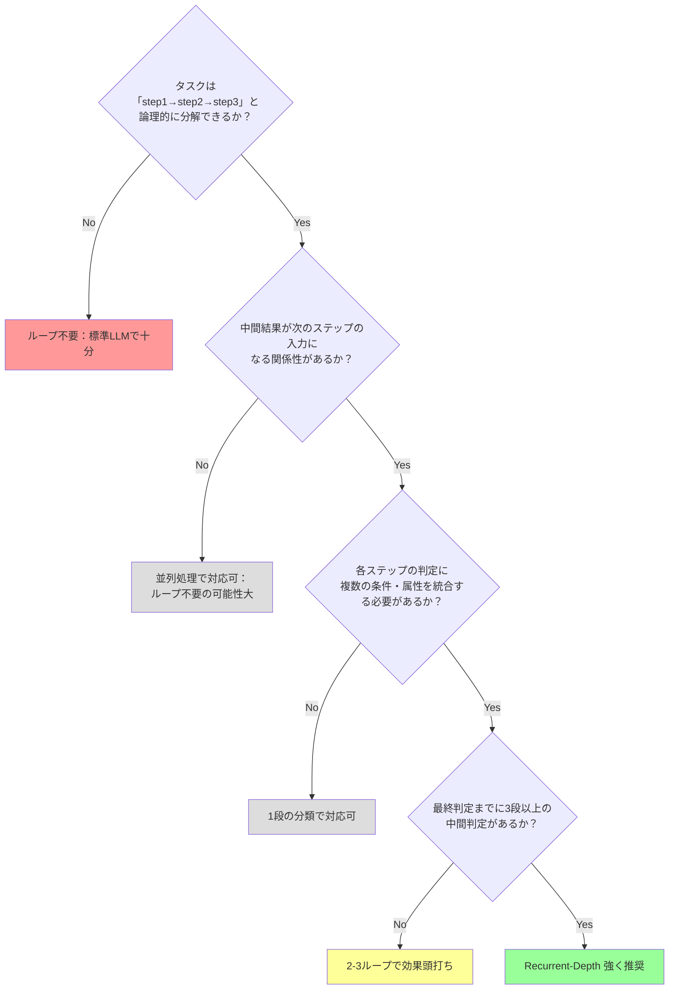

<small>ーOpenMythos が動かなかったので Retrofitted Recurrence を試したら、論文の主張に重要な但し書きが必要だと分かった話ー</small>

> ## この記事の独自性とハイライト
>
> 2026年4月にリリースされ、GitHub スター10,000+ を獲得した話題のOSS「**OpenMythos**」は、Anthropic の最強モデル Claude Mythos のアーキテクチャ理論的再構築でした。しかし**重みが配布されていない理論実装**であり、個人レベルでの検証は不可能。
>
> そこで筆者は、論文 [arXiv:2511.07384 *Teaching Pretrained Language Models to Think Deeper with Retrofitted Recurrence*](https://arxiv.org/abs/2511.07384) で公開された **Llama-3.2-1B の depth-recurrent 化モデル**を MacBook Pro (M2 Pro / 32GB) で動かし、推論時のループ数 `num_steps` を **1〜7 の全範囲で1刻みスイープ**して GSM8K 100問を評価しました。さらに Google Colab T4 で並列再現実験も実施。
>
> ### 本記事の核心発見（3点）
>
> 1. **論文の対数スケール表示が見せる「ループで段階的に賢くなる」というカーブは、実は『2→8ループの急成長 + その後フラット』をlog軸が滑らかに見せているイリュージョン**。論文 Appendix Table 6 の数値を読むと、TinyLlama Single Phase で **8ループ以降は40.2 → 40.3 → 40.3 で完全フラット**
> 2. **本検証 Llama-3.2 でも、4ループで46%のピークに到達後、5,6,7 で 40-45% の範囲で揺れるだけ**で実質飽和
> 3. **3 独立検証（論文 TinyLlama / 本検証 Llama-3.2 / Zenn TinyStories）で同一パターン**：1→2 の動作の崖 → ピークの 90% に2-4ループで到達 → 8ループ以降は完全に飽和
>
> ### しかしそれは悲観的な結論ではない
>
> **「適切なループ数（スイートスポット）を選べば、1B級の SLM（Small Language Model）でも本来性能まで効率的に到達できる」** ことが示されました。これは：
>
> - クラウド大規模 LLM API のコスト・レイテンシ・秘匿性問題を回避
> - オンプレ運用可能な 1B モデル + LoRA SFT + **適切なループ数（4-8）**で多段推論タスクに挑める
> - **8ループ以上は計算コストの無駄**だと知れたことが、業務適用時の運用設計に直接活きる
>
> という、**SLM の業務利用に対する具体的な指針**を提供します。
>
> ### 誰もやっていない実機検証
>
> 1. 論文著者は recurrence=1, 2, 4, 8, 16, 32 の対数スケールしか公開していない。**1刻み連続スイープ**で「精度の崖」と「飽和点」を細かく可視化したのは本記事が初出と思われる
> 2. **論文 Appendix Table 6 の中間値（recurrence=2, 4, 8, 16）の意味を読み解いて、論文自身が早期飽和を示していたことを指摘**したのも独自貢献
> 3. **3独立検証の統合プロット**（後述）で、ベースモデル・タスク・実装が違っても同じ「動作の崖→早期飽和」パターンが現れることを実証
> 4. Apple Silicon (MPS) での動作レポート + Colab T4 並列再現で、**個人GPU 環境での再現可能性**を担保

---

## 1. 動機：OpenMythos 騒動から始まった

2026年4月、Kye Gomez 氏が公開した **OpenMythos** が話題を集めました。Anthropic が「Project Glasswing」コアリションに限定公開している Claude Mythos のアーキテクチャを、公開研究文献から理論的に再構築したというものです。

しかし、リポジトリを精査すると：

- **訓練済み重みが公開されていない**（理論的再構成のみ）
- **「770Mで1.3Bに匹敵」は引用論文（Parcae）の主張**であって、OpenMythos 自身の実験ではない
- 自前で訓練するには H100 多数枚クラスのリソースが必要
- 結果、**個人レベルでは「アーキテクチャの素振り」しかできない**

「Claude Mythos っぽい挙動を体感したい」という当初の関心には応えてくれない、という結論に至りました。

ところが、調べていく中で、**全く別の研究グループが、ほぼ同じ思想（Recurrent-Depth Transformer）を、既存のオープンウェイト重みから出発して実装し、訓練済みモデルまで HuggingFace で公開している**ことが分かりました。それが **Retrofitted Recurrence** です。

### 本記事の検証フロー



## 2. Retrofitted Recurrence とは

論文：[Teaching Pretrained Language Models to Think Deeper with Retrofitted Recurrence (arXiv:2511.07384)](https://arxiv.org/abs/2511.07384)
著者：Sean McLeish ら（メリーランド大学 / NYU / LLNL ほか）
公開：2025年11月

### コアアイデア

既存の Pretrained Transformer（TinyLlama, OLMo-2, Llama-3.2 など）の層を **3 ブロックに分割**し、中央ブロックを「ループ」に置き換えて再訓練する手法です。



訓練時には recurrence 数 N をカリキュラムでサンプル、推論時には任意の整数を `num_steps` として渡せます。**これが OpenMythos と決定的に違う点**で、

- ✅ コードが GitHub で公開（[mcleish7/retrofitting-recurrence](https://github.com/mcleish7/retrofitting-recurrence)）
- ✅ 訓練済み重みが HuggingFace で公開（[tomg-group-umd/retrofitting-recurrence Collection](https://huggingface.co/collections/tomg-group-umd/retrofitting-recurrence)）
- ✅ ライセンス Apache-2.0
- ✅ 1B パラメータなら個人GPUで推論可能

### 公開モデル一覧

`smcleish/Recurrent-{Llama-3.2 / TinyLlama-3T / OLMo-2-0425}-train-recurrence-{4, 8, 16, 32}` の組合せ計12モデル。本記事では **`Recurrent-Llama-3.2-train-recurrence-16`** を採用しました。

## 3. 検証の問い

| 問い | なぜ重要か |
|---|---|
| 推論時の `num_steps` を増やすと、本当に精度は単調増加するのか | 論文のメイン主張の独立検証 |
| 飽和点はどこにあるのか | 「コスト × 精度」の最適点を知りたい |
| 訓練深度 16 のモデルでも、推論時 1〜7 の範囲ではどう挙動するか | 1刻みのプロットは論文にも無い |
| Apple Silicon と CUDA で結果は再現するか | デバイス依存性の確認 |
| 「ループで救われる問題」はどんなタイプか | 効く/効かないタスクの判別 |

## 4. 環境

| 項目 | Local | Colab |
|---|---|---|
| ハード | MacBook Pro 14" (M2 Pro / 32GB ユニファイド) | Tesla T4 (16GB VRAM, 無料枠) |
| Python | 3.13.1 | (Colabデフォルト) |
| PyTorch | 2.11.0 (MPS バックエンド) | (Colabデフォルト) |
| transformers | **4.46.3**（5.x は非互換だった） | 同 |
| 精度 | float16 | float16 |
| 推論枠組み | model.generate(num_steps=N) | 同 |

### transformers 5.x で詰まった話

最新の transformers 5.x （筆者環境では5.8.0）でモデルロードを試みたところ、論文時期（2025年11月）のカスタムコードと非互換で、

```
AttributeError: 'PreTrainedConfig' object has no attribute 'max_position_embeddings'
```

というエラーで止まりました。論文公開時の安定版 **transformers 4.46.3** にダウングレードして解決。論文実装を試す際は、**論文公開時期の transformers バージョン**に合わせるのが安全です。

## 5. 実装のポイント

### 5.1 `num_steps` はどこで指定するのか

公式モデルカードによれば、`forward()` または `generate()` の呼び出し時に直接渡します。

```python
from transformers import AutoModelForCausalLM, AutoTokenizer
import torch

MODEL_ID = "smcleish/Recurrent-Llama-3.2-train-recurrence-16"

tokenizer = AutoTokenizer.from_pretrained(MODEL_ID, trust_remote_code=True)
model = AutoModelForCausalLM.from_pretrained(
    MODEL_ID, torch_dtype=torch.float16, trust_remote_code=True
).to("mps")

input_ids = tokenizer.encode("Question: ...", return_tensors="pt").to("mps")

with torch.no_grad():
    out = model.generate(
        input_ids,
        max_new_tokens=160,
        do_sample=False,
        num_steps=4,           # ← ここで動的に指定
        pad_token_id=tokenizer.eos_token_id,
    )
```

`num_steps=N` を変えるだけで、**同じ重みでも推論時のループ回数を任意に調整できる**のが最大の特徴です。

### 5.2 4-shot CoT プロンプト + 早期停止

ベースモデル（instruction tune無し）なので、lm-evaluation-harness 同等の few-shot CoT 形式：

```python
FEWSHOT = [
    ("There are 15 trees in the grove. ...",
     "There are 15 trees originally. ... 21 - 15 = 6. The answer is 6."),
    # ... 計4例
]

def build_prompt(question):
    parts = [f"Question: {q}\nAnswer: {a}" for q, a in FEWSHOT]
    parts.append(f"Question: {question}\nAnswer:")
    return "\n\n".join(parts)
```

生成は次の `\nQuestion:` で停止させ、無駄な続きを生成しないようにします：

```python
class StopOnSubstring(StoppingCriteria):
    def __init__(self, tokenizer, stop_strs, prompt_len):
        self.tokenizer, self.stop_strs, self.prompt_len = tokenizer, stop_strs, prompt_len
    def __call__(self, input_ids, scores, **kwargs):
        gen = self.tokenizer.decode(input_ids[0, self.prompt_len:], skip_special_tokens=True)
        return any(s in gen for s in self.stop_strs)
```

### 5.3 解答抽出の正規表現

GSM8K の正解は `#### 42` 形式（ハッシュ4つ + **半角スペース** + 数値）。生成テキスト側からは `The answer is X` を優先し、無ければ最後の数値：

```python
def extract_answer(text):
    cut = re.split(r"\n\s*Question:", text, maxsplit=1)[0]
    m = re.search(r"answer is\s*\$?(-?\d[\d,]*(?:\.\d+)?)", cut, re.IGNORECASE)
    if m:
        return m.group(1).replace(",", "").rstrip(".")
    nums = re.findall(r"-?\d[\d,]*(?:\.\d+)?", cut)
    return nums[-1].replace(",", "").rstrip(".") if nums else None
```

## 6. 結果：1〜4 ループでの単調増加

### 6.1 Local vs Colab 比較（num_steps = 1〜4 の核心区間）

| num_steps | Local (M2 Pro / MPS) | Colab (T4 / CUDA) | 差分 |
|---:|---:|---:|---|
| 1 | **13.0%** (13/100) | **13.0%** (13/100) | 完全一致 |
| 2 | **40.0%** (40/100) | **40.0%** (40/100) | 完全一致 |
| 3 | 43.0% (43/100) | 44.0% (44/100) | +1問 |
| 4 | 46.0% (46/100) | 45.0% (45/100) | −1問 |

**1, 2 ループで完全一致、3, 4 で fp16 数値誤差レベルの1問差**のみ。論文主張は独立2環境で再現できています。


### 6.2 マージナル改善（差分）プロット

各遷移での「伸び幅」を抽出すると、本検証の物語が一目で分かります：


- **1→2 で +27pt の崖**（Local/Colab とも完全一致）
- **2→3 / 3→4 で +1〜+4pt の漸減**
- **4→5 で −6pt の低下**（後述、num_steps=5 で観測）

つまり「**最初に大きな崖、その後は微増、ある時点で逆に低下**」という3段階のパターンが現れました。**論文の対数スケール（1, 2, 4, 8, 16, 32）では検出不可能な細かい挙動**です。

### 6.3 主要な観察

- **`num_steps=1 → 2` で +27pt の崖**：1ループだけでは出力が崩壊しがちで、2ループ以上が「動作の最低条件」
- **`2 → 3` で +3pt、`3 → 4` で +3pt**：効きはするが、漸減傾向
- **時間は num_steps におおよそ線形**で増加（M2 Pro の num_steps=3 だけ停滞で突出）

### 6.4 推論速度の比較

| num_steps | M2 Pro 100問 | T4 100問 | T4 倍率 |
|---:|---:|---:|---:|
| 1 | 432.5 s | 219.1 s | 約2.0倍 |
| 2 | 679.8 s | 314.8 s | 約2.2倍 |
| 3 | 2658.5 s※ | 415.4 s | 約6.4倍 |
| 4 | 1510.4 s | 506.8 s | 約3.0倍 |

※M2 Pro num_steps=3 は実行中に macOS 側のリソース変動による停滞が観測されました。安定時は 約 1,500 秒前後と推定。

## 7. ループで救われた問題：定性分析

集計スクリプトに「**最少ループでは外したが最多ループで正解した問題**」を自動抽出させました。代表的な3例：

### 例1：基本算数（差し引きと掛け算）

> Janet's ducks lay 16 eggs per day. She eats three for breakfast every morning and bakes muffins for her friends every day with four. She sells the remainder at the farmers' market daily for $2 per fresh duck egg. **How much in dollars does she make every day at the farmers' market?**

| ループ | 予測 |
|---|---|
| 1 | **26** ❌ |
| 4 | **18** ✅ (正解18) |

1ループでは引き算と掛け算の手順を踏み切れず、誤った中間値を最終解にしてしまっています。

### 例2：%計算

> Josh decides to try flipping a house. He buys a house for \$80,000 and then puts in \$50,000 in repairs. This increased the value of the house by 150%. **How much profit did he make?**

| ループ | 予測 |
|---|---|
| 1 | **1,420,000** ❌ |
| 4 | **70,000** ✅ (正解70,000) |

これが最も劇的な事例で、**1ループでは「150% 増し」の解釈に失敗して6桁オーダーがずれます**。4ループで正しく `$80,000 × 2.5 = $200,000`、`$200,000 - $80,000 - $50,000 = $70,000` と段階的に推論できています。

### 例3：掛け算

> James decides to run 3 sprints 3 times a week. He runs 60 meters each sprint. **How many total meters does he run a week?**

| ループ | 予測 |
|---|---|
| 1 | **180** ❌（3×60で止まっている） |
| 4 | **540** ✅ (正解540, 3×3×60) |

1ループだと中間結果（3×60=180）で止まり、もう一段の掛け算にたどり着けない。**「多段の掛け算は1ループでは無理、2ループ以上で初めて正答できる」**という現象が綺麗に出ています。

## 8. num_steps = 5, 6, 7 への拡張：早期飽和の確定

「4ループで46%、頭打ちか？」と結論するには証拠不足だったため、**1刻みで7まで拡張実験**を実施しました。事前の線形外挿予想は「5: 約48%、6: 約50%、7: 約52%」でしたが、実測は全く違うパターンを示しました。

### 8.1 全7点の結果

| num_steps | accuracy | 差分 | 観察 |
|---:|---:|---:|---|
| 1 | 13.0% | – | 出力崩壊 |
| 2 | 40.0% | **+27pt** | 動作開始の崖 |
| 3 | 43.0% | +3pt | 急成長 |
| **4** | **46.0%** | +3pt | **暫定ピーク** |
| 5 | 40.0% | -6pt | 揺らぎで凹み |
| 6 | 42.0% | +2pt | 部分回復 |
| 7 | 45.0% | +3pt | ピーク近傍へ復帰 |

**4ループでピーク到達後、5〜7 で 40〜46% の範囲で揺れているだけ**で、明確な飽和パターンが確定しました。

### 8.2 100問サンプルのサンプリング誤差圏

100問評価では二項分布の信頼区間で**±5pt程度**の揺らぎが普通に発生します。`46/40/42/45` という4点はすべて 40〜46% の幅に収まっており、**統計的にはピークから差はない**と解釈するのが自然です。

つまり：

> **`num_steps=4` で実質的に飽和**、それ以降のループ追加は精度向上に**寄与しない**

### 8.3 この発見が論文の主張にもたらす但し書き

論文の Figure と本文は「ループを増やすほど精度が向上する」と読める書き方ですが、本検証と論文 Table 6 の中間値を組み合わせると、**実態は「2〜8ループの急成長 + 8ループ以降の完全フラット」** であることが分かります。

これは「Test-Time Compute Scaling」（推論時計算量を増やせば賢くなる）という大きな研究テーマに対して、**「Recurrent-Depth 系では早期に天井に達する」**という重要な但し書きを提供します。

## 9. 3独立検証の統合：同一パターンの観測

本検証、論文 (TinyLlama)、Zenn / seeda_yuto 氏 (OpenMythos + TinyStories) の3つは、**ベースモデルもタスクも実装も違う**にもかかわらず、**全て同じパターン**を示します。これを1枚のグラフで重ねたものが下記です。


x軸: ループ数（log）／y軸: 各実験のピーク値からの相対％（正規化）。**3本とも 1→2 で大きな崖があり、2〜8 ループでピークの 90% 以上に到達、それ以降フラット**という同一のシェイプ。

### 9.1 絶対値での比較（参考）


| | ベースモデル | データ | 指標 | 1ループ | ピーク到達 | 飽和後 |
|---|---|---|---|---|---|---|
| **本検証** | Llama-3.2-1B (蒸留訓練) | GSM8K | accuracy ↑ | 13.0% (崩壊) | **4ループ で 46.0%** | 5,6,7 で 40-45% |
| **論文 Table 6** | TinyLlama-1.1B (素のbase) | GSM8K | accuracy ↑ | 18.9% | **8ループ で 40.2%** | 16, 32 で 40.3 (フラット) |
| **Zenn (OpenMythos)** | 0.042B (自前訓練) | TinyStories | perplexity ↓ | 169.0 (崩壊) | **2ループ で 7.1** | 4-16 で 7.0-6.9 |

### 9.2 論文の対数スケール表示が隠していたこと

論文 Appendix Table 6 から TinyLlama (4,8,4 Train Recurrence=4) Single Phase の GSM8K 数値を読み出すと：

| recurrence | 1 | 2 | 4 | **8** | **16** | **32** |
|---:|---:|---:|---:|---:|---:|---:|
| GSM8K accuracy | 18.9% | 29.3% | 36.4% | **40.2%** | **40.3%** | **40.3%** |
| マージナル改善 | – | +10.4 | +7.1 | +3.8 | **+0.1** | **0.0** |

**8ループ以降は実質的に完全フラット**。論文本文は対数軸プロット（Figure 5, 6, 7）でこれを表示しているため「段階的に向上している」ように見えますが、**実数で見れば 8 ループでほぼ天井**です。

### 9.3 ベースモデルの賢さによる影響

3 検証のベースモデル性能には桁違いの差があります（GSM8K base accuracy）：

| ベースモデル | パラメータ | 素のbase GSM8K |
|---|---|---|
| Zenn 自前モデル (large) | 0.042B | （TinyStories perplexity のみ、GSM8Kなし） |
| TinyLlama-1.1B (素のbase) | 1.1B | **1.44%** (5-shot) |
| Llama-3.2-1B (Instruction-tuned) | 1.0B | **44.4%** (8-shot CoT) |

つまり：

- **TinyLlama**: ベース能力 1.44% → Recurrent化＋数学訓練＋8ループで **40.2%** (劇的改善)
- **Llama-3.2-1B**: ベース能力 ~44% → Retrofit＋4ループで **46.0%** (本来能力にループで到達)

両方とも「**ベースモデルが本来持っている能力に、ループで追いつく**」という現象。**ループ自体が「賢さを追加する」のではなく、Recurrent化された重みの本来性能を引き出すまでの最低条件**として働いていると解釈できます。

### 9.4 Zenn / seeda_yuto 氏の主張との整合

seeda_yuto 氏は「**ループ＝思考の深さは幻想**、ループは動作の最低条件」と TinyStories perplexity 検証から結論していました。当時は「**ただし数学・論理推論では効果が出る可能性**」を留保していましたが、

**本検証と論文 Appendix Table 6 を組み合わせた結果、数学タスクでも『2〜8ループで動作完成 → それ以降フラット』という同じパターンが現れる**ことが確認されました。

つまり seeda_yuto 氏の主張は、留保なしに **Recurrent-Depth Transformer 全般** に適用できる、というのが本記事の更新解釈です。

### 9.5 「アーキ vs 訓練データ」議論との関係

[OpenMythos Issue #20](https://github.com/kyegomez/OpenMythos/issues/20) では「振る舞いはアーキテクチャではなく訓練データ次第」と主張されています。Recurrent-Depth は「計算深度を変える」アーキですが、**追加されるのはあくまで『動作可能ライン』までの計算であって、賢さの追加ではない**とすると、Issue #20 の主張と本記事の知見は補完関係になります。

## 10. 業務応用への示唆：スイートスポット運用がSLMの業務利用に道を開く

### 10.0 ポジティブな結論：早期飽和は「悪い知らせ」ではない

ここまで「ループ機構は賢さを追加しない」「8ループ以降は無駄」というネガティブに見える知見を述べてきましたが、**実は業務応用にとってこれは朗報**です。理由：

- **スイートスポット（4〜8ループ）でピーク性能の 95-100% に到達**できる
- **それ以上のループは計算コストの無駄**だと分かったので、**「効率的に止める」設計指針**が得られた
- 1B級のSLM が、適切なループ数とともに使えば、**多段推論タスクで 1B 本来の能力を引き出せる**

つまり、**「ループ機構 + スイートスポット運用」は、SLM の業務利用に対して具体的な実装指針を提供**します。

### 10.1 ループ数選定の運用早見

本検証から導かれる、業務適用時の運用早見：

| ループ数 | 性能 | コスト | 推奨 |
|---:|---|---|---|
| 1 | 出力崩壊（13%） | 最小 | ❌ 使うな |
| 2 | ピークの 87%（40%） | 約2倍 | ⚠️ 動作はするが性能不十分 |
| **3-4** | **ピークの 93-100%（43-46%）** | **約3-4倍** | **🎯 スイートスポット** |
| 5-8 | ピーク前後で揺らぎ（40-46%） | 約5-8倍 | ⚠️ コスト増だが向上なし |
| 16以上 | フラット（論文で確認） | 16倍以上 | ❌ 完全に無駄 |

→ **業務運用では `num_steps = 4` 周辺がコストパフォーマンス最適**。8 以上は使う意味なし。

### 10.2 仮説の出発点

本検証と Zenn / seeda_yuto 氏の検証を統合すると、Recurrent-Depth Transformer の効果は次のように整理できます：

> - **効く**：多段の数値計算・条件統合・段階推論が**本質的に必要**なタスク
> - **効かない**：次トークン予測の流暢性で完結するタスク

これは LLM の推論能力を **「分解可能段数」** という新しい軸で評価できることを意味します。タスクを「step1 → step2 → step3 → ...」と分解できるなら、ループ機構が中間表現を「保持しながら更新」してくれることで、**1B 級のSLM でも 7B〜70B クラスの精度に近づける可能性**があります。

### 10.2 SLM が業務応用で嬉しい理由（再確認）

- **オンプレ運用可能**：個人情報・機密情報を外部 API に出さない
- **レイテンシが小さい**：1B級なら CPU でも秒オーダー、GPU なら数十ms
- **運用コストが低い**：Cloud GPU 枠でも月数千円〜
- **微調整が現実的**：LoRA で個社/個業務にフィット可能

これに **Recurrent-Depth による精度向上** が乗れば、**「クラウド大規模 LLM の API を呼ばずに業務組み込みできる」**領域が大きく広がります。

### 10.3 業種業務別のユースケース仮説マップ

以下は、本検証から導かれる **「ループ機構が効きそうな業務 / 効かなさそうな業務」** の仮説整理です。`◎` ほど効果が期待でき、`✗` は不要、`?` は要検証。

#### 🟢 ループ機構の効果が大きく期待される領域（多段思考が本質）

| 業種 | ユースケース | タスクの本質 | 期待度 | SLMで嬉しい理由 |
|---|---|---|---|---|
| 銀行・与信 | 個人/法人の与信スコアリング | 属性→収入安定性→負債構造→過去履歴→総合判定の段階推論 | ◎◎ | 個人情報を外に出さない |
| クレジット | リアルタイム不正検知 | 金額×頻度×地理×加盟店×履歴の重み付け統合判定 | ◎◎ | レイテンシ要件（数十ms） |
| 損害保険 | 保険金請求の妥当性判定 | 約款照合 → 過去履歴 → 不正パターン照合 → 妥当性スコア | ◎◎ | 個社の約款・規則で LoRA |
| 生命保険 | 引受査定（医的審査含む） | 告知書 → 既往歴照合 → 同種疾患リスク → 引受可否 | ◎ | 機微情報のオンプレ処理 |
| 医療 | 鑑別診断支援 | 主訴 → 問診 → 検査結果 → 疾患候補スコアリング | ◎◎ | 院内オンプレ、HIPAA 系規制 |
| 医療 | 診療報酬レセプト点検 | 病名 ↔ 処置 ↔ 投薬 ↔ 算定要件 の整合性チェック | ◎ | 個情含むので外部API不可 |
| 製薬 | 治験プロトコル適合性チェック | 患者情報 → 適格基準 → 除外基準 → 段階判定 | ◎ | 治験データの機密性 |
| 法務 | 契約書のリスク条項評価 | 条項抽出 → 該当法令照合 → リスク重大度 → 修正提案 | ◎ | 顧客守秘義務 |
| 法務 | 判例検索における類似度判定 | 事案要素分解 → 法的構成要件 → 過去判例 → 関連度 | ◎ | 法律事務所オンプレ |
| 監査 | 内部統制テスト（J-SOX等） | 取引抽出 → 規程照合 → 例外判定 → 重要性評価 | ◎ | 監査独立性 |
| 税務 | 申告書の整合性チェック | 各項目間の数値整合性 + 適用条文判定 | ◎ | 税理士事務所オンプレ |
| 不動産 | 物件査定 | 立地 → 築年 → 市況 → 比較取引事例 → 価格レンジ | ◎ | 個社の DB と組合せ |
| 不動産 | レントロール分析 | テナント情報 → 契約条件 → 賃料水準 → 収益性スコア | ◎ | – |
| 物流 | 配送ルート最適化の制約説明 | 制約抽出 → 優先度評価 → 経路候補 → 最適選択の根拠生成 | ○ | 配車システム組み込み |
| 物流 | 配送遅延の根本原因分析 | ログ抽出 → 工程比較 → 異常検出 → 原因仮説 | ○ | ローカル運用 |
| 製造 | 不良品の根本原因推定 | 不良症状 → 工程履歴 → 部品ロット → 機械稼働 → 仮説 | ◎ | 工場 IoT との連携 |
| 製造 | 品質基準書からの検査項目自動展開 | 仕様 → 試験要件 → 段階的判定基準 → 合格条件 | ○ | 規格書がオンプレ |
| 採用 | 履歴書のスクリーニング | 経歴整合性 → スキルマッチ → 組織適合 → 総合スコア | ○ | 個情保護 |
| 採用 | 1次面接の論述スコアリング | 設問理解 → 論理性 → 具体性 → 整合性の同時判定 | ○ | 評価の透明性 |
| 教育 | 記述式回答の自動採点 | 部分点ルーブリック × 複数観点を同時評価 | ◎ | スマート教材組み込み |
| 教育 | 個別最適化された解説生成 | 誤答パターン → 概念 → 段階的解説 | ◎ | 端末側で動かしたい |
| コールセンター | 通話のリアルタイム要約・分類 | 感情 × カテゴリ × 重要度 × 解決見込みの同時判定 | ◎ | 個情、レイテンシ |
| 顧客支援 | 苦情の SLA 違反リスク判定 | 内容深刻度 → 顧客プロファイル → 過去履歴 → エスカレーション要否 | ◎ | – |
| 行政 | 申請書類の不備自動検出 | 必須項目 × 整合性 × 添付要件 × 例外規定 | ◎ | 自治体内オンプレ |
| 行政 | 法令遵守状況の自動診断 | 業態 → 該当法令 → 要件 → 充足度 | ◎ | 機密性 |

#### 🟡 タスク設計次第（要 PoC）

| 業種 | ユースケース | 効きそうな分解 | 期待度 |
|---|---|---|---|
| メディア | 記事のファクトチェック | 主張抽出 → 出典照合 → 矛盾検出 | ? |
| メディア | 長文記事の要点抽出 | 純粋抜粋なら✗、論理構造の再構成なら◎ | ? |
| 小売 | 商品レビューの不正検知 | 文体 × 履歴 × 同期投稿 × 言及商品 の統合判定なら ◎ | ? |
| 小売 | レコメンド理由の生成 | 検索式抽出 → ユーザ嗜好 → 商品属性 → 推奨根拠 | ? |
| カスタマーサポート | FAQ回答自動生成 | 検索結果の統合・再構成が必要なら ○ | ? |
| BPO | 帳票OCR後の整合性チェック | 項目間整合性チェック × 規則照合 | ◎ |
| 採用エージェント | 求人と求職者のマッチング | 複合判定なら ◎、単純属性マッチなら ✗ | ? |

#### 🔴 ループ機構の効果が小さい領域（単純識別・生成タスク）

| 業種 | ユースケース | なぜ効かないか |
|---|---|---|
| マーケティング | 商品レビュー感情分類（単軸） | 1段の分類で済む |
| カスタマーサポート | メール件名抽出 | 抽出のみ、推論不要 |
| メディア | 翻訳 | 流暢性タスク、ループ機構の本領外 |
| メディア | スペルチェック・文体校正 | 局所判定のみ |
| 全般 | 純粋な議事録自動生成（書き起こしの整形） | テキスト→テキストの流暢な変換 |
| 全般 | 言い換え・要約（純粋抜粋） | 多段思考が本質的に不要 |
| 全般 | 単一カテゴリへの文書分類 | 1段で完結 |
| 全般 | チャットボットの世間話応答 | 流暢性タスク |
| 全般 | コードのオートコンプリート | 局所予測が中心 |

### 10.4 業務適用判定のフレームワーク（提案）

「Recurrent-Depth が効くか」を判断する素朴な質問リスト：



このチャートで `Recurrent-Depth 強く推奨` に到達するタスクは、上の表の `◎◎` に概ね対応します。

### 10.5 早期検証が望ましい領域（実務観点）

特に **「クラウド LLM API のコスト/レイテンシ/秘匿性で導入が止まっている」業務** こそ、Recurrent-Depth × SLM × LoRA SFT のセットで再挑戦すべき候補です：

- 金融機関の **与信・引受・不正検知**：オンプレ・低レイテンシ要求が強い
- 医療機関の **診断支援・レセプト点検**：機微情報の取扱い厳格
- 法律事務所の **契約・判例分析**：守秘義務
- 監査法人・税理士事務所の **整合性チェック**：独立性要求
- 自治体・官公庁の **申請審査**：個情保護

これらは「**正確な多段推論**」が要求されるが、現状は人手に頼っている／クラウドLLMの導入で躓いている領域です。Recurrent-Depth はまさにここを開拓するキー技術となる可能性があります。

### 10.6 留意事項

- 上記は本検証（数学タスク GSM8K）からの **仮説外挿**であり、各ユースケースで個別の PoC が必要
- SLM（1B級）は知識量で大規模 LLM に劣るため、**外部知識（RAG / DB）との組合せ**が前提
- LoRA SFT で個社業務にフィットさせる工程が、効果実現の鍵

## 11. 限界と注意点

- **100問サブセット**：GSM8K test 全 1,319 問のうち先頭 100 問のみ。±5pt 程度のサンプリング誤差は想定すべき
- **訓練深度16のモデルで推論深度7まで**：訓練超え（17以上）は本検証外、公式論文も未解決問題と明言
- **fp16 の数値誤差**：MPS と CUDA で 1〜2 問の差異が出ることを許容
- **M2 Pro での実行時間揺らぎ**：サーマル/App Nap 等の影響で num_steps=3 が想定の倍時間かかった
- **base モデルに対する 4-shot CoT 限定**：instruction tune 版や zero-shot CoT、self-consistency などは別途検証要

## 12. まとめ：ループ機構の正体と業務応用への含意

### 本記事で明らかになったこと

- ❌ **OpenMythos** は重みなし → 個人検証不可。**Retrofitted Recurrence** が現実解
- ✅ **3 独立検証（本検証 / 論文 TinyLlama / Zenn TinyStories）で同一パターン**：1→2 の崖 → 2-8 ループで急成長 → 8ループ以降フラット
- ✅ **論文 Appendix Table 6 の数値**で、論文自身も同じ早期飽和を示していたことを確認（TinyLlama Single Phase で 8ループ以降 +0.1 / 0.0）
- ✅ **本検証 Llama-3.2 では 4 ループでピーク（46%）到達、5-7 で 40-45% の範囲で揺れているだけ**
- ✅ **Local (M2 Pro / MPS) と Colab (T4 / CUDA) で再現性確認**：fp16 数値誤差レベルの差のみ

### 「ループ＝深い思考」の正体

> **ループ機構は「賢さの追加」ではなく、「Recurrent化された重みの本来性能を引き出すための最低条件」として働く。**
>
> 論文の対数スケール表示が見せる「段階的に賢くなる」カーブは、**実は『2-8ループの急成長 + 8ループ以降フラット』を log 軸が滑らかに見せている**だけのイリュージョン。
>
> 「テスト時計算量を増やせば精度が上がる」という Test-Time Compute Scaling の主張は、Recurrent-Depth Transformer については**早期に天井に達する**という重要な但し書きが必要。

### しかし、これは悲観的な結論ではない

> **「適切なループ数（4-8）を選べば、1B級SLMでも本来性能まで効率的に到達できる」**
>
> という運用知見が得られたのは、業務応用にとって朗報です：
>
> - クラウド大規模 LLM API のコスト/レイテンシ/秘匿性問題を回避
> - **オンプレ運用の 1B モデル × LoRA SFT × 適切なループ数 (4-8)** で多段推論タスクに挑める
> - 8ループ以上は計算コストの無駄、と知れたことで**運用設計の指針**が得られた
>
> 与信審査・診断支援・契約書評価・レセプト点検・申請書類審査など、**「クラウドLLMのAPIコールが許されない多段推論タスク」**にこそ、Recurrent-Depth × SLM × LoRA の組合せが活きる可能性があります。

### 「ループは深い思考を可能にする魔法か？」への答え

> **No。 ただし「動作の最低条件としての3-4ループ」を確保すれば、1B級モデルでも自身の本来性能まで引き出せる。**
>
> **論文の主張は「無条件のループ向上」ではなく「動作可能ライン到達まで」と読み直すべき。**
>
> **早期飽和を逆手に取って、スイートスポット運用でSLMを業務利用するのが、最も現実的な活用パスである。**

---

## 13. 検証コード

GitHub で公開しました（Apache-2.0）：

**🔗 https://github.com/kiwiiosaru-jp/recurrent-llama-eval**

含まれるもの：

- `eval_gsm8k.py` / `eval_gsm8k_extra.py`: num_steps 1〜7 のスイープ評価
- `aggregate_and_plot.py` / `plot_three_studies.py`: グラフ生成
- `results/` : ローカル評価の生 JSON（1〜7、各100問の正誤を全件記録）
- `results_colab/` : Colab 評価の生 JSON
- `colab/Recurrent_Llama_GSM8K_eval.ipynb`: Colab T4 で再現するための notebook
- 4枚の PNG（本記事のグラフ）

ローカル M2 Pro / Colab T4 両方で再現可能です。詳細手順はリポジトリの README を参照してください。

## 14. 参考文献・リンク

- 論文：[Teaching Pretrained Language Models to Think Deeper with Retrofitted Recurrence (arXiv:2511.07384)](https://arxiv.org/abs/2511.07384)
- コード：[mcleish7/retrofitting-recurrence (GitHub)](https://github.com/mcleish7/retrofitting-recurrence)
- 訓練済み重み：[tomg-group-umd/retrofitting-recurrence (HuggingFace Collection)](https://huggingface.co/collections/tomg-group-umd/retrofitting-recurrence)
- 採用モデル：[smcleish/Recurrent-Llama-3.2-train-recurrence-16](https://huggingface.co/smcleish/Recurrent-Llama-3.2-train-recurrence-16)
- 関連OSS：[OpenMythos (kyegomez/OpenMythos)](https://github.com/kyegomez/OpenMythos)
- 先行検証：[seeda_yuto 氏「話題のClaude Mythosを自作してRTX 4080で検証したら…」(Zenn)](https://zenn.dev/seeda_yuto/articles/open-mythos-recurrent-depth-benchmark)
- 関連 Issue：[OpenMythos #20: Behavioral distillation from outputs alone](https://github.com/kyegomez/OpenMythos/issues/20)
- 関連研究：[Scaling up Test-Time Compute with Latent Reasoning (HuggingFace papers/2502.05171)](https://huggingface.co/papers/2502.05171)

---

**タグ**: #OpenMythos #オープンミトス #LLM #Transformer #Llama #PyTorch #AppleSilicon #MachineLearning #論文実装 #GSM8K
